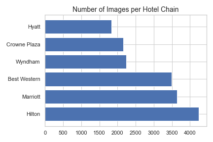
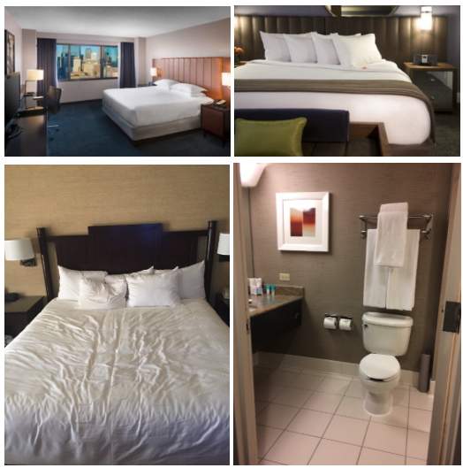
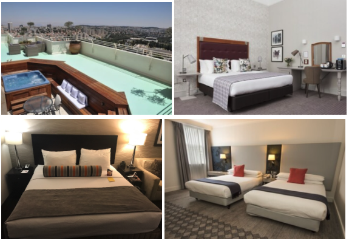
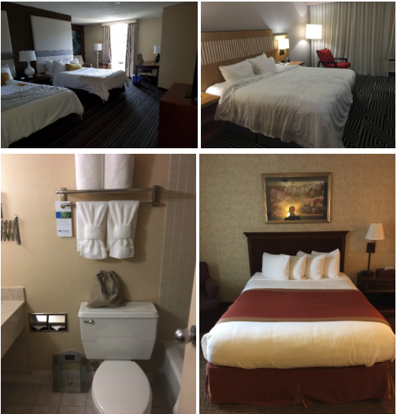
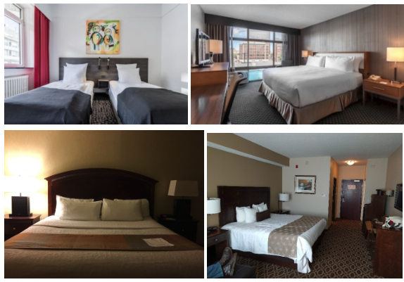
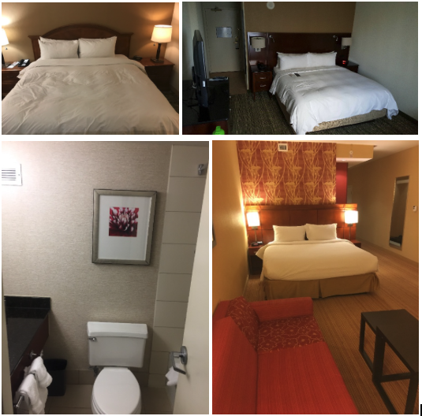
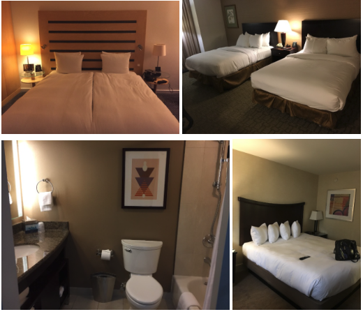

# Preventing Sex Trafficking in Hotels

## Table of Contents
1. [Description](#description)
2. [Data Overview](#DataOverview)
3. [Data Preparation](#DataPreparation)
4. [Modeling](#Modeling)
5. [Summary](#Summary)

## Description <a name="description"></a>
Sex trafficking in the United States is a hidden problem that people know exist but little is being done to prevent it. It's estimated that roughly 400,000 people are victims of sex trafficking according to the Global Slavery Index. In 2019, 12 major hoteliers were sued for their reckless inaction and role in the sex slave trade of women and children according to Reuters. A Cornell study titled Hotels-50K dataset was created in early 2019 which identifies hotel chains and their respective locations based on images from travel websites in an effort to combat sex trafficking in hotels. Reuters states that the top offending hotels include "Hilton Worldwide Holdings Inc., Red Roof Inn, Intercontinental Hotels & Resorts, Best Western Hotels & Resorts and Wyndham Hotels and Resorts Inc." These hotels should be held accountable or at the very least, be a part of preventing the problem.

## Data Overview <a name="DataOverview"></a>
The Hotels-50K dataset contains a training dataset with over 1 million images from 90 hotel chains and a testing dataset which includes 17,954 images with varying levels of occlusion. For the purposes of this project, I will be using the training dataset which do not contain human-shaped masks/occlusions to predict hotel chains. Specifically, I want to use Convolutional Neural Networks, CNN, to predict Hyatt, Crowne Plaza, Wyndham, Best Western, Marriott, and Hilton hotels based on their images.




## Data Preparation <a name="DataPreparation"></a>
The amount of images in the original dataset is quite large with over 1 million images. Since the test dataset contains occlusions while the training dataset does not, I opted to work with the training dataset only. For this project, I have chosen well-known hotel names as well as hotel names mentioned in the lawsuit article by Reuters. The images were heavily nested within chain folders by location folders and image source folders. I traveresed through many directories to organize and prepare the hotel chain files for modeling.

The six chosen hotel chain files contained over 1000 images each totalling 14,085 images for training and 3,520 images for testing.

#### Hyatt

#### Crowne Plaza

#### Wyndham

#### Best Western

#### Marriott

#### Hilton

     
## Modeling <a name="Modeling"></a>
Modeling proved quite challenging because of how long it takes to train a model using CNN. Hyperparameter tuning is important to adjust these models' performance. Overall, fine-tuning the model hyperparameters didn't improve the test accuracy score much whereas the training data accuracy score would sometimes improve at anywhere from 20 percent to 50 percent accuracy. This implies that the model is over fitting to the training dataset most of the time. The test dataset often scored around 20 to 30 percent accuracy.


     
#### Base Model
The base model is to predict the most frequent class--which in this case is Hyatt hotels with 4,244 images. The base model of predicting a hotel image as Hyatt is 24 percent.

## Summary <a name="Summary"></a>
### Next steps
I was challenged by how finnicky the model is and how much attention it requires, but I am optomistic that with more data and hyperparameter tuning, the model can successfully identify hotel chains by their images. Some of the images vary location to location with some containing food or people--perhaps a more thorough cleansing of the images for future iterations may improve the process.

## Citation

```authors: Stylianou, Abby and Xuan, Hong and Shende, Maya and Brandt, Jonathan and Souvenir, Richard and Pless, Robert,
title: Hotels-50K: A Global Hotel Recognition Dataset,
booktitle: The AAAI Conference on Artificial Intelligence (AAAI),
year: 2019

author: Matthew Lavietes,
title: "Top hotels sued for 'industry-wide failures' to prevent U.S. sex trafficking",
link: https://www.reuters.com/article/us-trafficking-hotels-usa/top-hotels-sued-for-industry-wide-failures-to-prevent-u-s-sex-trafficking-idUSKBN1YE074,
year: 2019

